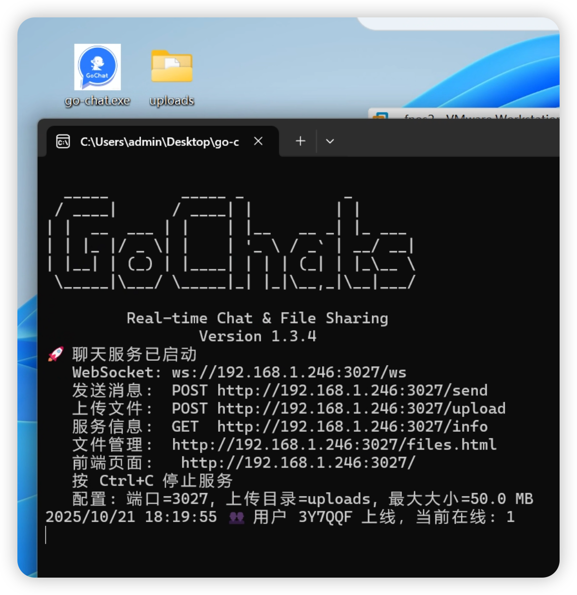

# 📄 Go 聊天室项目说明文档,局域网发消息发文件测试使用

---

## 🎯 项目简介

这是一个基于 **Go 语言** 学习开发的轻量级 **实时聊天系统**，支持：

- 多人实时文字聊天（WebSocket）
- 文件上传与分享（图片自动预览，其他文件可下载）
- 系统消息通知（用户上线/离线）
- 响应式网页界面（适配桌面与手机）

适用于内网协作、学习演示或小型团队沟通。

下载go-chat.exe 双击打开运行即可

```
## 示例截图



```


## 📁 项目结构

```
gochat/
├── go.mod                # Go 模块定义
├── main.go               # 服务端主程序
└── public/
    ├── index.html        # 聊天主界面
    └── files.html        # 文件管理页
```

文件默认上传至 `./uploads/` 目录。

文件本身保存在服务器的 `./uploads/` 目录下，但数据（如上传时间）只存在于内存消息中， **重启服务后会清理** 。

---

## ⚙️ 运行环境要求

- Go 1.20+
- 网络可访问（部署后通过浏览器访问）
- （推荐）Linux / Windows / macOS 均可

---

## 🚀 快速启动（国内环境）

### 一条命令运行（自动使用国内镜像）

```bash
GOPROXY=https://goproxy.cn,direct go run main.go
```

> 首次运行会自动下载依赖，后续可直接 `go run main.go`

---

## 🌐 访问方式

服务默认监听 **3027 端口**，启动后：

- 聊天页面：`http://<服务器IP>:3027/`
- 示例：`http://192.168.1.100:3027`（内网）或 `http://your-domain.com:3027`（公网）

> 💡 建议搭配 Nginx 反向代理 + HTTPS 用于公网部署。

---

## 🔒 安全提醒（重要！）

本项目为**演示/内网用途设计**，若部署到公网，请务必：

1. **限制文件上传类型**（仅允许 `.jpg`, `.png`, `.pdf` 等）
2. **重命名上传文件**（避免路径遍历或恶意脚本执行）
3. **不要开放 `uploads` 目录的执行权限**
4. **启用 HTTPS/WSS**（防止消息被窃听）
5. **考虑添加身份验证**（当前无登录机制）

> ⚠️ 未经加固的公网部署可能导致服务器被入侵！

```bash
# 默认启动
go run main.go

# 自定义配置
./gochat -port=9000 -upload-dir=chat_files -max-size=200M

# Windows
# 正常就直接运行exe
go-chat.exe -max-size=1.5G -upload-dir="D:\chat\uploads"


```
